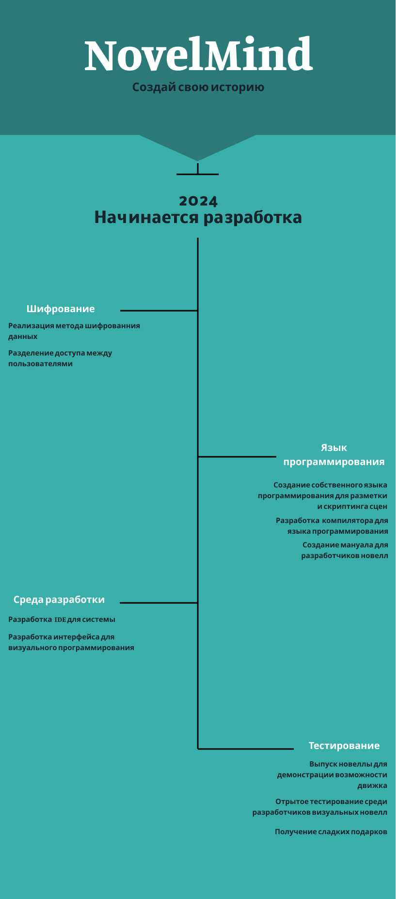

<div align="center">
  
  <h1 style="font-size: 3em;  text-shadow: 2px 2px 4px rgba(0,0,0,0.1);">NovelMind</h1>
  <p><strong style="font-size: 1.2em;;">Инновационный визуальный редактор для создания визуальных новелл</strong></p>
  <p>
    
    
    
  </p>
</div>

---

<p style="font-size: 1.1em; text-align: center;">
NovelMind - это проект, направленный на упрощение процесса создания визуальных новелл, предоставляя разработчикам мощные инструменты в удобном визуальном интерфейсе, одновременно обеспечивая безопасность их работы.
</p>

<details>
<summary style="font-size: 1.5em; cursor: pointer;">📑 Оглавление</summary>

- [🌟 Ключевые особенности](#-ключевые-особенности)
- [🛤️ Дорожная карта](#️-дорожная-карта)
- [📁 Файловая система](#-файловая-система)
- [📊 Система логирования](#-система-логирования)
- [🏗 Структура бэкенда](#-структура-бэкенда)
- [🛣 API маршруты](#-api-маршруты)

</details>

---

## 🌟 Ключевые особенности

<div style=" padding: 20px; border-radius: 10px; box-shadow: 0 4px 6px rgba(0,0,0,0.1);">

1. 🔐 **Безопасная файловая система:** 
   <p style="margin-left: 20px;">Встроенная система шифрования файлов предотвращает несанкционированный доступ к ресурсам проекта.</p>

2. 🖱️ **Визуальное позиционирование элементов:** 
   <p style="margin-left: 20px;">Интуитивно понятный интерфейс позволяет разработчикам перетаскивать спрайты и другие элементы непосредственно на сцену.</p>

3. 🎭 **Визуальное программирование:** 
   <p style="margin-left: 20px;">Возможность визуально программировать ход новеллы, включая порядок диалогов и другие элементы повествования.</p>

4. 🔧 **Внутренний язык программирования:** 
   <p style="margin-left: 20px;">Собственный скриптовый язык для более тонкой настройки и программирования сложных сценариев.</p>

5. 🚀 **Компиляция в исполняемый файл:** 
   <p style="margin-left: 20px;">По завершении разработки, весь проект (включая ресурсы, диалоги и скрипты) может быть скомпилирован в единый исполняемый файл одним нажатием кнопки.</p>

6. 🎮 **Простота использования:** 
   <p style="margin-left: 20px;">Готовая новелла запускается простым запуском скомпилированного файла.</p>

</div>

---

## 🛤️ Дорожная карта

<details>
<summary style="font-size: 1.2em; cursor: pointer;"><strong>Развернуть/Свернуть Дорожную карту</strong></summary>
<div align="center" style="margin-top: 20px; animation: fadeIn 1s;">
  
</div>
<p align="center" style="font-style: italic; margin-top: 10px;">
Изображение дорожной карты отражает планы и этапы развития NovelMind. На каждом этапе предусмотрены обновления, улучшающие функциональность и удобство использования.
</p>
</details>

<style>
  @keyframes fadeIn {
    from { opacity: 0; }
    to { opacity: 1; }
  }
</style>

---

## 📁 Файловая система

<p style="font-size: 1.1em;">
Файловая система NovelMind обеспечивает безопасное хранение и управление файлами с использованием шифрования. Ниже представлена документация по компонентам ядра (Core) и API файловой системы.
</p>

<details>
<summary style="font-size: 1.2em; cursor: pointer;"><strong>Компоненты ядра (Core)</strong></summary>

### Компоненты ядра (Core)

Основные компоненты включают следующие модули:

1. [Шифрование](#шифрование)
2. [Обработчик файлов](#обработчик-файлов)
3. [Инициализатор файловой системы](#инициализатор-файловой-системы)
4. [Безопасное хранилище](#безопасное-хранилище)
5. [Вспомогательные функции](#вспомогательные-функции)

<div style="padding: 15px; border-radius: 10px; margin-top: 20px;">

#### Шифрование

Файл: `encryption.py`

##### Класс: AdvancedEncryptor

Класс для обработки шифрования и дешифрования данных с использованием AES шифрования.

Основные методы:
- Инициализация с ключевыми файлами
- Загрузка или генерация ключей
- Шифрование и дешифрование данных
- Ротация ключей
- Экспорт публичного ключа

#### Обработчик файлов

Файл: `file_handler.py`

##### Класс: SecureFileHandler

Класс для обработки безопасных файловых операций.

Основные методы:
- Добавление, чтение, удаление файлов
- Создание, переименование, удаление директорий
- Перемещение файлов
- Проверка существования директорий

#### Инициализатор файловой системы

Файл: `initializer.py`

##### Класс: FileSystemInitializer

Класс для инициализации файловой системы для безопасного хранения.

Основные методы:
- Инициализация файловой системы
- Инициализация шифрования
- Создание пустого индекса

#### Безопасное хранилище

Файл: `storage.py`

##### Класс: SecureStorage

Класс для обработки безопасного хранения и извлечения метаданных файлов.

Основные методы:
- Загрузка и сохранение индекса
- Добавление и удаление файлов
- Управление структурой директорий

#### Вспомогательные функции

Файл: `utils.py`

Функции:
- Создание директории, если она не существует
- Проверка валидности пути

</div>

</details>

---

## 📊 Система логирования

<p style="font-size: 1.1em; ">
Система логирования NovelMind предоставляет гибкие и многофункциональные возможности для ведения логов, обеспечивая поддержку многоуровневого логирования, форматирования в JSON и автоматического логирования функций и классов.
</p>

<details>
<summary style="font-size: 1.2em; cursor: pointer;"><strong>Подробности системы логирования</strong></summary>

<div style="padding: 15px; border-radius: 10px; margin-top: 20px;">

### Основные функции

1. **Многоуровневое логирование**: DEBUG, INFO, WARNING, ERROR и CRITICAL.
2. **Логирование в файл и консоль**: С ограничением размера и ротацией файлов.
3. **Форматирование в JSON**: Для упрощения анализа и парсинга.
4. **Автоматическое логирование функций и классов**: С помощью декораторов.
5. **Дополнительный контекст**: Возможность добавления контекстной информации.
6. **Порог ошибок**: Ограничение количества одинаковых сообщений об ошибках.
7. **Информация о системе**: Логирование системной информации.
8. **Идентификатор трассировки**: Для отслеживания связанных логов.
9. **Профилирование функций**: Для анализа производительности.

### Класс Logger

#### Инициализация

```python
Logger(log_file: str = 'app.log', use_json: bool = False, 
       max_log_size: int = 10*1024*1024, backup_count: int = 5,
       error_threshold: int = 10, error_window: int = 3600)
```

#### Основные методы

- Методы логирования (debug, info, warning, error, critical)
- Декораторы для логирования функций и классов
- Установка уровня логирования
- Профилирование функций
- Логирование системной информации

</div>

</details>

---

## 🏗 Структура бэкенда

<p style="font-size: 1.1em;">
Бэкенд NovelMind организован в модульную структуру, обеспечивающую четкое разделение ответственности между различными компонентами.
</p>

<div style=" padding: 15px; border-radius: 10px; margin-top: 20px;">

```
src/
└── backend/
    ├── app.py
    ├── __init__.py
    ├── file_operations/
    │   ├── __init__.py
    │   ├── routes.py
    │   └── service.py
    └── system_operations/
        ├── __init__.py
        ├── routes.py
        └── service.py
```

- `app.py`: Основной файл приложения Flask
- `file_operations/`: Модуль для файловых операций
- `system_operations/`: Модуль для системных операций

</div>

---

## 🛣 API маршруты

<p style="font-size: 1.1em; ">
API NovelMind предоставляет ряд эндпоинтов для управления файловой системой и выполнения системных операций.
</p>

<details>
<summary style="font-size: 1.2em; cursor: pointer;"><strong>Подробности API маршрутов</strong></summary>

<div style="padding: 15px; border-radius: 10px; margin-top: 20px;">

### Системные операции

- `POST /api/system/deploy`: Развертывание файловой системы

### Файловые операции

- `POST /api/files/add_file`: Добавление нового файла
- `GET /api/files/read_file`: Чтение содержимого файла
- `DELETE /api/files/delete_file`: Удаление файла
- `GET /api/files/list_files`: Получение списка всех файлов
- `POST /api/files/create_directory`: Создание новой директории
- `PUT /api/files/rename_directory`: Переименование директории
- `DELETE /api/files/delete_directory`: Удаление директории
- `PUT /api/files/move_file`: Перемещение файла
- `PUT /api/files/change_directory`: Изменение текущей директории
- `GET /api/files/current_directory`: Получение текущей директории

</div>

</details>

---

<p align="center" style="font-size: 1.2em; margin-top: 30px;">
  Создано с ❤️ командой NovelMind
</p>

<style>
@keyframes pulse {
  0% { transform: scale(1); }
  50% { transform: scale(1.01); }
  100% { transform: scale(1); }
}

summary {
  transition: all 0.3s ease;
}

summary:hover {
  color: #007bff;
  animation: pulse 1s infinite;
}
</style>